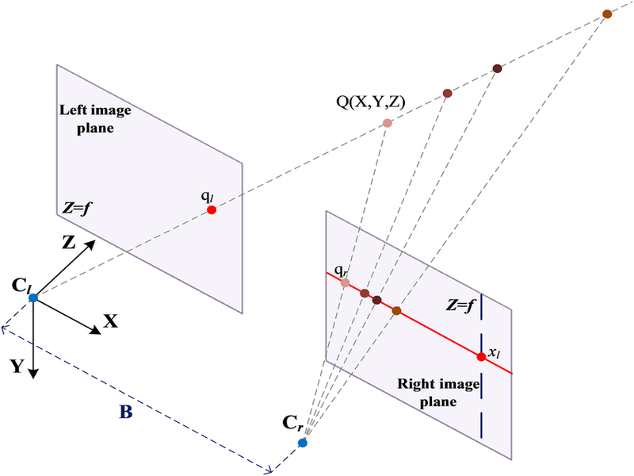
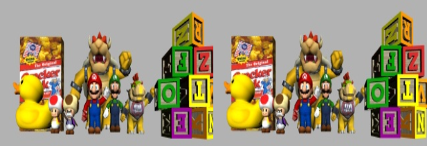
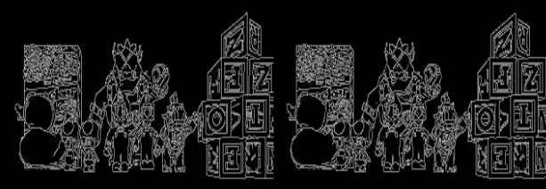
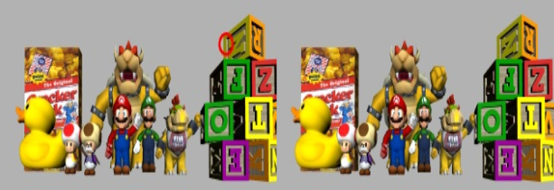
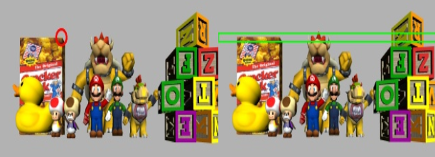

## Adquisición de Imágenes Estéreo 📸

La visión estéreo usa dos cámaras que capturan la escena desde ángulos ligeramente distintos. En el escenario de la simulación estas cámaras se encuentran perfectamente alineadas de manera que, sus ejes ópticos son paralelos entre sí, sus planos de imagen son coplanares y las líneas epipolares son horizontales. 

A esta configuración ideal se le llama canónica, y al par de imágenes que cumplen estas condiciones se les llama imágenes estéreo rectificadas. Esta alineación simplifica mucho la búsqueda de puntos correspondientes, ya que solo hay que buscar a lo largo de la misma fila en la otra imagen. En la Figura 1, se representa dicha configuración junto a sus centros ópticos, la línea epipolar resultantes y la localización tridimensional de un punto característico. 


**_Figura 1_**: Geometría epipolar \
_[Adil, Elmehdi & Mikou, Mohammed & Mouhsen, Ahmed. (2022). A novel algorithm for distance measurement using stereo camera. CAAI Transactions on Intelligence Technology. 7. n/a-n/a. 10.1049/cit2.12098.]_

Por tanto, el primer paso constituye en extraer las imágenes correspondientes a las cámaras que observan la escena. 

**Python: Get Images**
```python title="3D_reconstruction.py"
imageLeft = HAL.getImage('left') 
imageRight = HAL.getImage('right')
``` 


## Preprocesamiento y Detección de Píxeles Característicos 

Una vez se tienen las imágenes extraídas, para facilitar la búsqueda de correspondencias entre ellas, se indentifican puntos caracterósticos. Este paso, aplica el detector de bordes Canny a las imágenes resaltando los píxeles donde hay cambios bruscos de intensidad, correspondientes a los contornos de los objetos. 

**Python: Canny Filter**
```python title="3D_reconstruction.py"
    image_gray = cv2.cvtColor(image, cv2.COLOR_BGR2GRAY)
    img_canny = cv2.Canny(image_gray, l_thr, h_thr)
``` 



Los pixeles resaltados en blanco se consideran píxeles característicos y serán los puntos a localizar en la otra imagen para obtener la reconstrucción tridimensional. 



## Establecimiento de la Geometría Epipolar

Tras la obtención de los pixeles característicos se deben aplicar los conceptos de geometría epipolar para poder proyectar la línea epipolar sobre la imagen derecha. Para ello, se seguirán los pasos descritos a continuación.

1. **Conversión de coordenadas (gráfico a óptico):** Se transforma las coordenadas de la imagen del píxel de interés al sistema de coordenadas óptico de esa cámara.
2. **Retroproyección (2D a 3D):** El punto 2D se retroproyecta hacia el espacio 3D, generando una recta epipolar en 3D que se origina en el centro óptico de la cámara y pasa por el punto de interés.
3. **Proyección en la imagen derecha (3D a 2D):** La recta epipolar se proyecta sobre el plano imagen de la otra cámara. Como resultado se obtiene la recta epipolar del pixel de interés definida en la imagen derecha. 
4. **Conversión de coordenadas (óptico a gráfico):** La recta 2D proyectada se convierte del sistema óptico de la cámara derecha a coordenadas de píxel. 
5. **Creacción de la franja epipolar:** Con el objetivo de facilitar la búsqueda de correspondencias, se determina un rectángulo de 7 píxeles de altura que contiene todos los píxeles de la línea epipolar dibujada.




## Búsqueda de Correspondencias
Después de calcular la franja epipolar 

**Python: Homologue Search**
```python title="3D_reconstruction.py"
# Parche  en imagen epi derecha
patch_r = imageRight[y_epi_min:y_epi_max + 1, x_epi_min:x_epi_max + 1]

# Parche en imagen izquierda
patch_l = imageLeft[y_px - block_size//2:y_px + block_size//2 + 1, x_px - block_size//2:x_px + block_size//2 + 1]

# Búsqueda de homólogo
res = cv2.matchTemplate(patch_r, patch_l, cv2.TM_CCORR_NORMED)
_, max_val, _, max_loc = cv2.minMaxLoc(res)
```

## Triangulación y Generación de la Nube de Puntos Tridimensional
