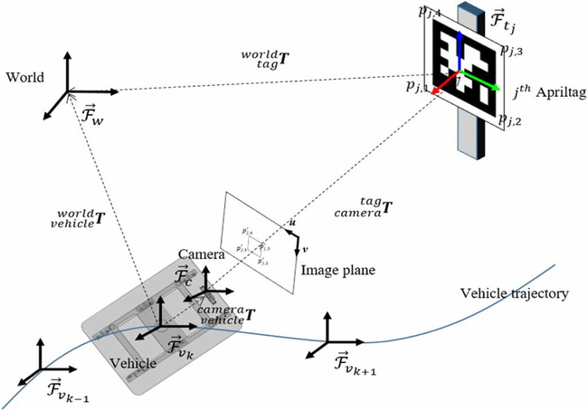
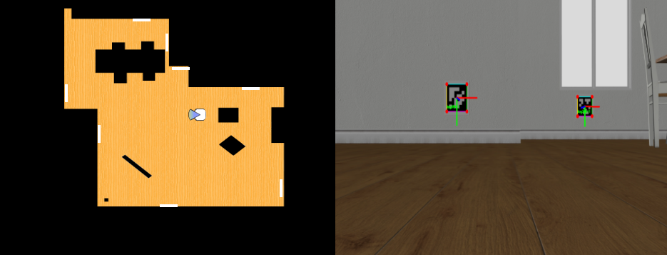

## Sistema de Posicionamiento 🧭
El uso de marcadores fiduciales como AprilTags permite obtener una localización precisa y robusta mediante técnicas de visión artificial. Esta estrategia se basa en la detección de marcadores visuales cuya geometría y posición en el mundo son conocidas de antemano. A partir de su aparición en la imagen captada por la cámara del robot, es posible estimar la pose relativa del marcador respecto a la cámara utilizando algoritmos como solvePnP.

Gracias a esta estimación y a la cadena de transformaciones geométricas, es posible inferir directamente la posición del robot en el entorno global. De esta forma, se logra un sistema de autolocalización visual sin necesidad de construir o cargar un mapa del entorno, , lo que permite una puesta en marcha más directa y flexible en entornos controlados.

La Figura 1, tomada del trabajo de Zhang et al. (2023) sobre localización visual en robótica agrícola, resume el esquema geométrico general para la estimación de la pose de un vehículo móvil. Este planteamiento teórico representa el fundamento del reto abordado en esta práctica.


**_Figura 1_**: Descripción del sistema de coordenadas para la localización del robot.\
_[Zhang, Wei & Gong, Liang & Sun, Yefeng & Gao, Bishu & Yu, Chenrui & Liu, Chengliang. (2023). Precise visual positioning of agricultural mobile robots with a fiducial marker reprojection approach. Measurement Science and Technology. 34. 10.1088/1361-6501/ace8b0. ]_

Por tanto, a priori, la estimación de la pose del robot se basa en una cadena de transformaciones que relaciona los distintos sistemas de referencia involucrados.

```math
RT_mundo_robot = RT_mundo_tag·RT_tag_camara·RT_camara_robot
```

## Detección de Marcadores AprilTags 🎯

El primer desafío a abordar es la detección de los marcadores AprilTags. Para ello, se emplea el detector _pyapriltags_, capaz de identificar en tiempo real las esquinas de cada marcador y extraer su identificador. Gracias a esta información, es posible acceder a la pose absoluta del marcador en el sistema de coordenadas global obteniendo su posición y orientación en el entorno. 

Para facilitar la depuración visual y comprobar que la detección de marcadores se realiza correctamente, se han añadido varios colores a los bordes de los marcadores detectados.


Una vez detectado un marcador válido, y conociendo su geometría real en el mundo, se procede a la obtención de la primera transformación, la pose del marcador respecto a la cámara. Para ello, se necesitan las coordenadas 3D reales de las esquinas del marcador, las coordenadas 2D de esas esquinas obtenidas por el detector y La matriz de parámetros intrínsecos de la cámara. 

Dicha matriz se ha construido a partir de los valores proporcionados por el simulador. 

**Comando: Matriz de intrínsecos.**
```python
    ros2 topic echo /turtlebot3/camera/camera_info
``` 
Con estos parámetros y asumiendo una lente sin distorsión, se resuelve el problema PnP mediante _cv2.solvePnP_, obteniendo los vectores de rotación y traslación que permiten construir la matriz **RT_tag_cam**. 

Para asegurar que la pose calculada con solvePnP es correcta, se realiza una validación visual directa. Por un lado, se dibujan los ejes del sistema del marcador sobre la imagen mediante cv2.drawFrameAxes, y además, permite comprobar su orientación. Por otro lado, se proyectan las esquinas 3D reales del marcador sobre la imagen usando cv2.projectPoints, y si estas coinciden con las esquinas detectadas, podemos confiar en que la transformación obtenida describe con precisión la relación entre el marcador y la cámara.
​

## Cadena de Transformaciones 👓

Al observar los ejes dibujados sobre la imagen del marcador, se aprecia que no se alinean con el sistema de referencia del simulador. Esto ocurre porque solvePnP devuelve la pose en el sistema óptico de OpenCV, donde el eje Y apunta hacia abajo y el Z hacia delante, lo cual no es compatible con el sistema usado para representar el mundo del robot.

Para resolverlo, se define una matriz de transformación que permite pasar del sistema óptico al sistema de referencia (**RT_optical_mundo**). Esta matriz rota -90° alrededor del eje X y luego -90° alrededor del eje Z, reorientando los ejes para que coincidan la referencia definida, eje X hacia delante, Y hacia la izquierda y Z hacia arriba. 

Además, la cámara se encuentra montada sobre el robot. Por tanto, se introduce también la transformación entre la cámara y el robot, permitiendo estimar la pose final del robot en el mundo.

Todas estas transformaciones se encadenan de forma consistente para describir la pose del robot en el mundo. 

```math
RT_robot_mundo = RT_tag_mundo · RT_optical_mundo · RT_cam_tag · RT_optical_mundo⁻¹ · RT_robot_cam
```

Dado que se obtiene la RT_tag_cam, y en la cadena de transformaciones se requiere su inversa, es decir, la transformación de la cámara respecto al marcador, **RT_cam_tag**, el único elemento restante para completar correctamente el sistema es la transformación entre la cámara y el robot. Dicha transformación, se obtiene mediante el comando mostrado a continuación.

**Comando: Matriz de transformación Cámara–Robot.**
```python
    ros2 run tf2_ros tf2_echo base_link camera_rgb_frame
``` 

# Estimación de la posición

Con todas las transformaciones necesarias obtenidas se realiza el cómputo final para estimar la pose del robot en el mundo. El resultado es una matriz homogénea de 4×4 que describe la orientación del robot dentro del sistema global de navegación, permitiendo la integración directa en la tarea de localización.

A partir de la matriz final RT_robot_world, se extraen directamente las coordenadas del robot. La posición se obtiene del vector de traslación, y la orientación se calcula por la arcotangente, que corresponde a la rotación en el plano.

En caso de no detectarse ningún marcador visible, la estimación de la posición se realiza mediante odometría. Dado que se conoce la velocidad lineal, el giro angular, se actualiza la pose integrando ambos términos. Este método, aunque funcional, está más expuesto a la acumulación de errores. 

En el vídeo adjunto se aprecia cómo la estimación deriva progresivamente hasta que vuelve a detectar un marcador, momento en que corrige automáticamente la posición estimada.

## Vídeo 🎥
1. [Autolocalización visual basada en marcadores apriltags completa.](https://youtu.be/UpFAeQSnzSg)