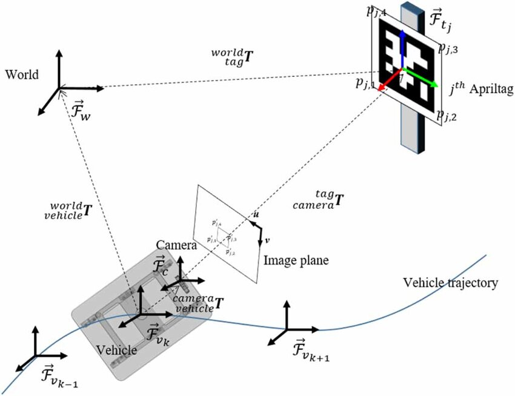

## Autolocalización Basada en Marcadores
El uso de marcadores fiduciales como AprilTags permite obtener una localización precisa y robusta mediante técnicas de visión artificial. Esta estrategia se basa en la detección de marcadores visuales cuya geometría y posición en el mundo son conocidas de antemano. A partir de su aparición en la imagen captada por la cámara del robot, es posible estimar la pose relativa del marcador respecto a la cámara utilizando algoritmos como solvePnP.

Gracias a esta estimación y a la cadena de transformaciones geométricas, es posible inferir directamente la posición del robot en el entorno global. De esta forma, se logra un sistema de autolocalización visual sin necesidad de construir o cargar un mapa del entorno, , lo que permite una puesta en marcha más directa y flexible en entornos controlados.

La Figura 1, tomada del trabajo de Zhang et al. (2023) sobre localización visual en robótica agrícola, resume el esquema geométrico general para la estimación de la pose de un vehículo móvil. Este planteamiento teórico representa el fundamento del reto abordado en esta práctica.


**_Figura 1_**: Descripción del sistema de coordenadas para la localización del robot.\
_[Zhang, Wei & Gong, Liang & Sun, Yefeng & Gao, Bishu & Yu, Chenrui & Liu, Chengliang. (2023). Precise visual positioning of agricultural mobile robots with a fiducial marker reprojection approach. Measurement Science and Technology. 34. 10.1088/1361-6501/ace8b0. ]_

Por tanto, a priori, la estimación de la pose del robot se basa en una cadena de transformaciones que relaciona los distintos sistemas de referencia involucrados.

```math
{}^{W}T_{\text{robot}} = {}^{W}T_{\text{tag}} \cdot {}^{\text{tag}}T_{\text{cam}} \cdot {}^{\text{cam}}T_{\text{robot}}
```

## Vídeo 🎥
2. [Autolocalización visual basada en marcadores apriltags completa.](https://youtu.be/UpFAeQSnzSg)