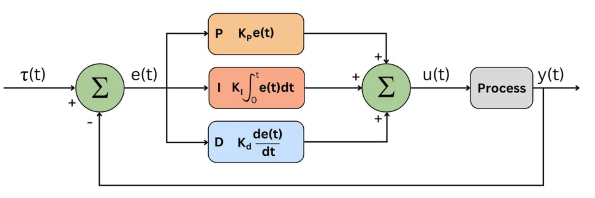
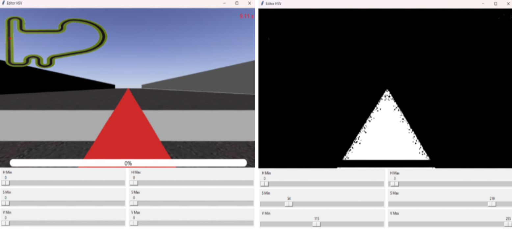
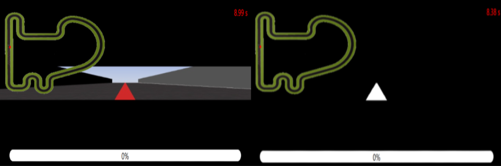
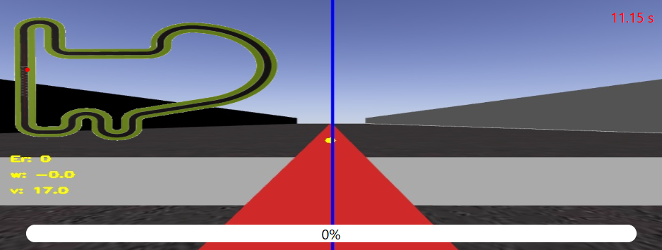

## Controlador PID 🔧
El controlador PID (Proporcional–Integral–Derivativo) es un algoritmo de control ampliamente utilizado en robótica para lograr la estabilidad y precisión en el movimiento de los robots. Utilizan un mecanismo de control de retroalimentación en bucle cerrado que ajusta continuamente las salidas en función de la diferencia entre un punto de ajuste deseado y el valor medido. 

Funciona ajustando la salida en función de tres términos: proporcional (P), integral (I) y derivativo (D). A continuación, en la Figura 1, se adjunta el diagrama estándar de un controlador PID donde se pueden observar los componentes mencionados, junto con las expresiones matemáticas que definen su comportamiento.


**_Figura 1_**: Diagrama Controlador PID \
_[Waseem, U. (2023, 20 junio). PID Controller & Loops: A Comprehensive Guide to Understanding and Implementation. Wevolver. https://www.wevolver.com/article/pid-loops-a-comprehensive-guide-to-understanding-and-implementation.]_

- Control Proporcional (P): Responde al error presente, generando una salida proporcional a su magnitud. Al aplicar una acción correctiva inmediata, el término P minimiza rápidamente los errores. Esto ayuda a que el robot se dirija hacia el punto deseado rápidamente. 
- Control Derivado (D): Prevé oscilaciones y movimientos bruscos al tener en cuenta la velocidad de cambio del error. Este enfoque amortigua las oscilaciones y estabiliza el sistema, especialmente durante las respuestas transitorias. Por tanto, ayuda a que el movimiento sea suave y preciso. 

- Control Integral (I): Aborda cualquier error persistente o desviaciones a largo plazo del punto de ajuste acumulando el error a lo largo del tiempo. Al integrar la señal de error, el término I asegura que el sistema se acerque y mantenga el punto de ajuste con precisión, eliminando los errores en estado estacionario. Esto es útil para eliminar errores de deriva o fluctuaciones en el movimiento. 


Un controlador PID calcula de forma continua una señal de error. En este contexto, el error representa cuánto se ha desviado el coche respecto a la trayectoria que debería seguir. A partir de esta información, el controlador ajusta la señal de control para corregir dicha desviación acorde a tres términos introducidos: Ganancia Proporcional (Kp), proporción de la señal de error que contribuye a la salida del controlador. Ganancia Derivativa (Kd), anticipa el comportamiento futuro del error basado en su tasa actual de cambio. Ganancia Integral (Ki), acumula errores pasados y corrige el desvío sostenido.

La configuración de estas tres ganancias influye directamente en el comportamiento del sistema, provocando oscilaciones ante valores demasiado altos o respuestas lentas e imprecisas cuando lo valores son demasiado bajos. La salida resultante se aplica a los actuadores del sistema, modificando la velocidad o el ángulo de giro para mantener una conducción estable y precisa. 


## Obtención de la región de interés 🎯
El primer paso de este reto consiste en definir la región de interés a partir de la cual se calculará el error de seguimiento. Dado que el objetivo es que el coche siga la línea roja del circuito, se aplica un filtro en el espacio de color HSV que permite segmentarla con precisión. 

Para ello, se construye una interfaz interactiva que permite ajustar dinámicamente los umbrales HSV sobre una captura del circuito, facilitando la selección precisa de los valores óptimos para detectar la línea roja de forma robusta. 



Una vez se aplica el filtro de color, se detecta el área del contorno visualizado correspondiente a la línea roja sobre el asfalto. A partir de este contorno se calcula su centroide, que sirve como referencia visual para estimar la desviación del vehículo respecto al eje central deseado. No obstante, dado que la cámara no está alineada exactamente con el centro del vehículo, se aplica una corrección de dos píxeles para compensar este desplazamiento.

Además, en lugar de calcular el error sobre la zona más cercana al vehículo, se define una franja superior, cercana al horizonte visual, que permite anticipar cambios en la trayectoria y simular un comportamiento más similar al de un conductor humano.



Por tanto, tras obtener la región de interés y el centroide de la línea roja, se calcula el error de seguimiento como la diferencia entre el centro de la imagen y la coordenada x del centroide. Este error indica cuánto se ha desviado el coche de la trayectoria ideal y será la entrada principal de los controladores, traduciéndose en correcciones sobre el ángulo de giro y la velocidad. 

Con el objetivo de facilitar la depuración y el análisis del comportamiento del sistema, se incorporan varios elementos visuales en la interfaz. Un punto amarillo, que representa el centroide de la línea roja detectada, una línea azul vertical, que inidca el centro corregido de la imagen, sirviendo como referencia para el cálculo del error y valores numéricos del error de seguimiento, el ángulo de giro y velocidad lineal. 




## Control cinemático 🚗
El sistema de control se compone de dos tipos de controladores, diseñados para regular el movimiento del vehículo a partir del error visual calculado.
1.  **Controlador PDI para el giro (w)**

Para corregir la desviación respecto a la línea, se implementa un controlador PDI. Este se aplica directamente sobre el error lateral obtenido. 

**Python: PDI angular**
```
def pdi_angular(error_w, error_pre_w, error_acc_w, Kp_w, Ki_w, Kd_w):
    d_w = error_w - error_pre_w
    error_acc_w += error_w
    w = -Kp_w * error_w - Ki_w * error_acc_w - Kd_w * d_w
    return w, error_w, error_acc_w
``` 

Además, el ángulo de giro resultante se limita con un umbral para evitar giros excesivos e irreales en un contexto realista. 

```
w = max(min(w, MAX_W), MIN_W)
HAL.setW(w)
```

## Escenarios adversos 👀

## Transición a modelo Ackermann 🏎️


## Vídeos 🎥
1. [Coche de dinámica simple en el circuito simple.](https://youtu.be/JZIK89bfv90)
2. [Coche de dinámica simple en el circuito Montreal.](https://youtu.be/BtUnzcoujMU)
3. [Coche de dinámica simple en el circuito Montmelo.](https://youtu.be/I7RpnVOXL80)
4. [Coche de dinámica simple en el circuito Nürburgring.](https://youtu.be/_HtSosXdhNs)
5. [Coche de dinámica Ackermann en el circuito simple.](https://youtu.be/53Szezdb8bA)